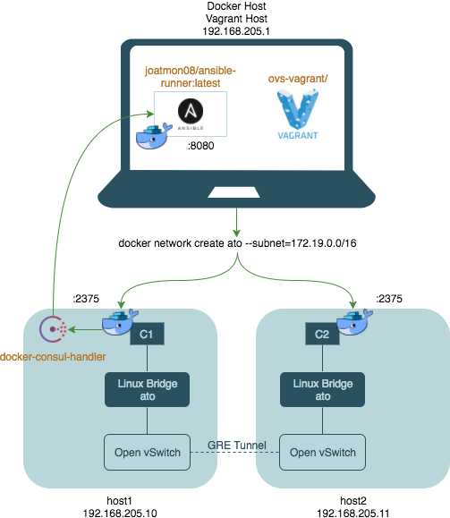

# Demo for All Things Open 2017

This project automates the [Kubernetes lab on Multi-Host Networking](http://docker-k8s-lab.readthedocs.io/en/latest/docker/docker-ovs.html),
where two Docker hosts have containers that need to route to each other. This is
not a recommended set up, but it is an interesting exercise in automation and
testing. The focus is on unit and integration tests to
build confidence in automation before applying it end-to-end.

**The code serves as an example. It omits important features that enable it
to run in production.**

## Dependencies
1. [docker-consul-handler](https://github.com/joatmon08/docker-consul-handler)
1. [ansible-runner](https://github.com/joatmon08/ansible-runner) : This needs
to be running on your Ansible control host to execute the OVS playbook.
1. [Vagrant](https://www.vagrantup.com/downloads.html)

## Automation Workflow
1. When creating a Docker network on Host 1, the Docker network is updated
in the Consul KV store. There is no Consul KV store on Host 2. _The Docker
network must have a bridge name that is the same as the network!!!_
1. The Consul KV store on Host 1 has a watcher in its configuration, which
fires a handler that calls a container called "ansible-runner" (see Dependencies).
The ansible-runner is hosted on a Docker host, exposed on port 8080 and its
sole responsibility is to run a playbook.
1. The ansible-runner runs the "playbook" to configure openvswitch on each
host. For reference, the veth interfaces are based on the minute and second
of creation.



## Testing Workflow
### Unit Tests
To Do

### Integration Tests
The integration tests contain a simple smoke test that creates two containers
on the Docker network and issues a ping call between them to determine if
there is connectivity. See the features directory.

The BDD feature:
1. Creates two hosts using Vagrant, host1 on 192.168.205.10 and host2
on 192.168.205.11.
1. Creates the ansible-runner container on the Vagrant host, with playbook
and SSH configuration mounted.
1. Creates the container network with name and CIDR block listed in
`features/connectivity.feature`.
1. Runs a smoke test under smoke.py. This creates a container on host1
and a container on host2, then issues a ping command between the containers.

#### Pre-Requisites
* Python 3.
* You must run `pip install -r requirements.txt`.
* Vagrant
* [joatmon08/ansible-runner:latest](https://hub.docker.com/r/joatmon08/ansible-runner/)

#### Run
```
behave
```

## References
* [Multi-Host Networking](http://docker-k8s-lab.readthedocs.io/en/latest/docker/docker-ovs.html)

## Manual References
## Vagrant SSH
Use `vagrant ssh-config` to retrieve the SSH configuration for the hosts.
You can pipe this to ssh-config and edit the configuration for the correct
identity file.

## Docker Network Creation
Create Docker network with custom bridge name:
```
docker network create -o "com.docker.network.bridge.name"="rlw" hi
```

## Open vSwitch Ansible Playbook
To run the Ansible playbook for Open vSwitch on its own, run:
```
ansible-playbook site.yml -b -i hosts --extra-vars "container_network=test"
```
